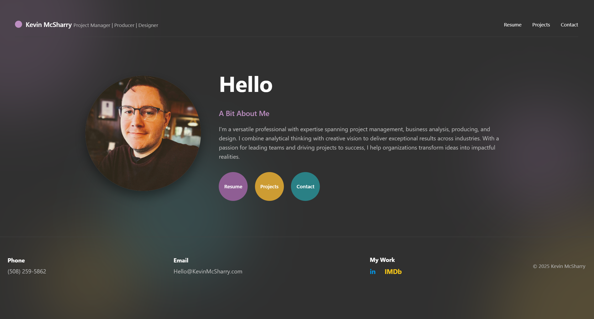

# Kevin McSharry Portfolio Website



## Overview

A modern, responsive, and accessible portfolio website for Kevin McSharry, showcasing his work as a Project Manager, Producer, and Designer. The site features a clean, professional design with interactive project filtering, animations, and optimized performance.

- **Live Site:** [kevinmcsharry.com](https://kevinmcsharry.com)
- **Repository:** [github.com/Soundlvl/Soundlvl.github.io](https://github.com/Soundlvl/Soundlvl.github.io)

## Features

- **Responsive Design** - Optimized for all device sizes from mobile to desktop
- **Interactive Project Filtering** - Dynamic filtering system for portfolio projects
- **Accessibility Compliant** - WCAG 2.11 AAA compliant with keyboard navigation, screen reader support, and sufficient contrast throughout
- **Animated UI Elements** - Subtle animations enhance user experience
- **Optimized Performance** - Fast loading with image optimizations and efficient code
- **SEO Ready** - Structured data and semantic markup for better search engine visibility

## Technology Stack

- **HTML5** - Semantic markup for better accessibility and SEO
- **CSS3** - Custom variables, flexible layouts with CSS Grid and Flexbox
- **JavaScript** - Vanilla JS for interactive elements (no frameworks)
- **Google Drive** - For PDF resume embedding
- **Schema.org** - Structured data for improved SEO

## Directory Structure

```
root/
│
├── index.html              # Home page
|── about.html              # About me page
├── projects.html           # Portfolio/project showcase
├── resume.html             # Professional resume page
├── contact.html            # Contact information and services
├── style.css               # Main stylesheet
├── scripts.js              # JavaScript functionality
│
└── Images/                 # Website images
    ├── Headshot.jpg        # Profile picture
    ├── OPGC.png            # Project images
    ├── crypt.png
    ├── Gridfinity.png
    ├── 3DModeling.png
    ├── Trailers.webp
    ├── IMDB.png
    ├── Linkedin.png
    ├── Github.png
    ├── pmp.png             # Certification badge
    └── screenshot.png      # Website screenshot for README
```

## Customization Guide

### Changing Colors and Theme

The site uses CSS variables for easy customization. In `style.css`, modify the `:root` section:

```css
:root {
    --primary: #303030;
    --color1: #E5AEEA;  /* Purple accent for text */
    --color1-dark: #8f5e94; /* Dark Purple accent for backgrounds*/
    --color2: #E9BC4F;  /* Yellow accent for text*/
    --color2-dark: #c39532; /* Dark Yellow accent for backgrounds */
    --color3: #56B9BF;  /* Teal accent for text*/
    --color3-dark: #2a8085; /* Dark Teal accent for backgrounds */
    --text-color: #ffffff;
    /* Other variables */
}
```

### Adding New Projects

1. Add a new project card to the `projects-grid` section in `projects.html`:

```html
<article class="project-card" data-category="project">
    <div class="project-image">
        
    </div>
    <div class="project-content">
        <h3>Project Title</h3>
        <p>Project description goes here...</p>
        <div class="project-tags" data-tags="Tag1,Tag2,Tag3">
            <span class="tag">Tag1</span>
            <span class="tag">Tag2</span>
            <span class="tag">Tag3</span>
        </div>
        <a href="https://project-url.com" class="project-link" target="_blank" rel="noopener">View Project →</a>
    </div>
</article>
```

2. Make sure to add appropriate tags in the `data-tags` attribute and as individual `<span class="tag">` elements.

### Adding New Project Categories

The project filtering system automatically detects all unique tags from your projects. Simply add new tags to the `data-tags` attribute in your project cards, and the filter system will include them.

## Development

### Modifying CSS

The CSS is organized into sections for easier maintenance:

1. Variables and Root Setup
2. Base styles and resets
3. Layout components
4. Header styles
5. Hero section
6. Project filtering system
7. Projects grid and cards
8. Resume page styles
9. Contact page styles
10. About page styles
11. Footer styles
12. Animations
13. Media queries
14. Utility classes
15. Print styles and reduced motion

Comments in the code help identify these sections.

### JavaScript Features

The JavaScript functionality is organized into several main functions:

- `initProjectFilter()` - Sets up project filtering system
- `initSmoothScroll()` - Enables smooth scrolling for anchor links
- `updateCopyrightYear()` - Dynamically updates copyright year
- `enhanceAccessibility()` - Adds various accessibility improvements

## Accessibility Features

- Semantic HTML structure
- ARIA labels and landmarks
- Keyboard navigation support
- Focus management
- Screen reader announcements
- Skip to content link
- Sufficient color contrast
- Reduced motion preference support
- Alternative text for images

## Performance Optimizations

- CSS containment
- Image lazy loading
- Deferred script loading
- Hardware-accelerated animations
- Event delegation for efficient event handling
- Optimized asset sizes
- Print styles for paper-friendly output

## Browser Compatibility

The website uses standard features and is compatible with:

- Chrome (latest)
- Firefox (latest)
- Safari (latest)
- Edge (latest)
- Mobile browsers (iOS Safari, Android Chrome)

## License

Website Code: MIT License, Copyright (c) 2025 Kevin McSharry
Website Content and Media: CC BY-NC 4.0